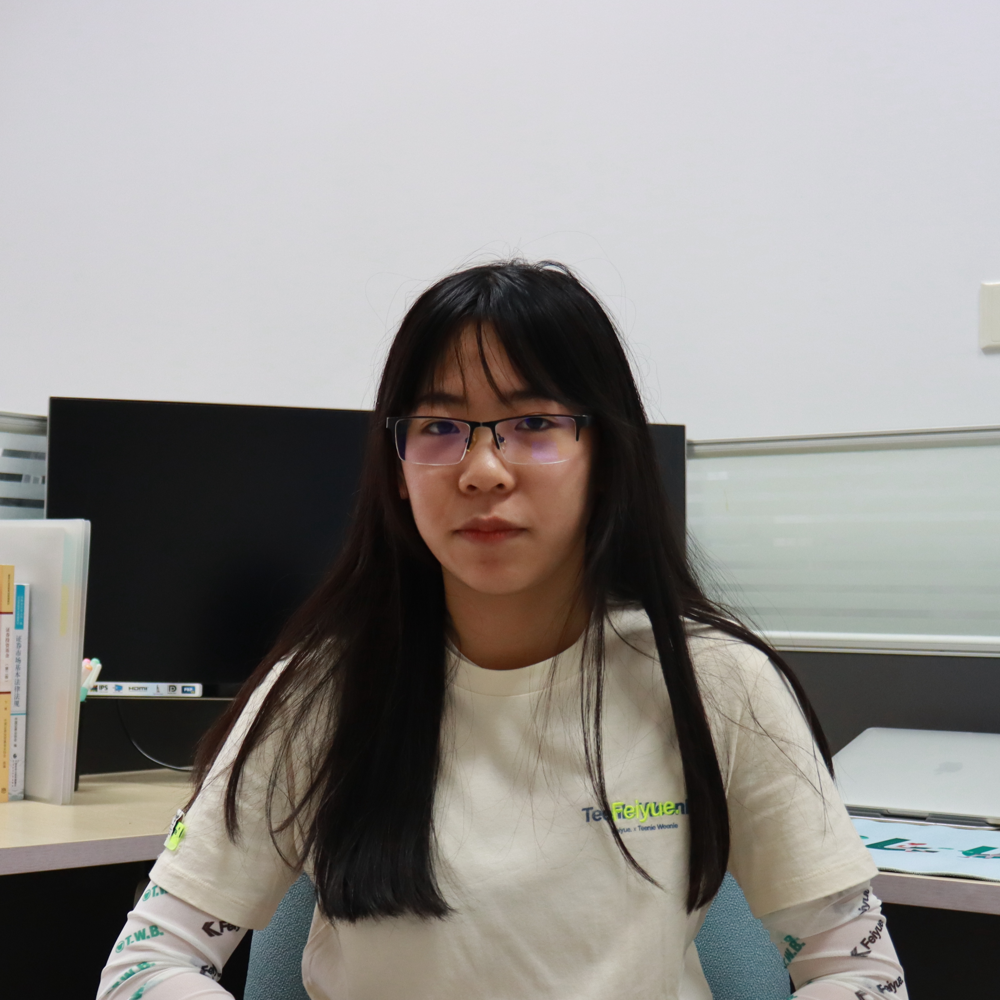

[Email](mailto:wanyu2@illinois.edu) \| [LinkedIn](https://www.linkedin.com/in/wyzhao/?locale=en_US) \| [Google Scholar](https://scholar.google.com/citations?user=Uung-WsAAAAJ&hl=en)

# Wanyu Zhao 

I am a second-year PhD at [UIUC CS](https://siebelschool.illinois.edu/) working with Prof. [Charith Mendis](https://charithmendis.com/).

My research interests lie in computer systems, machine learning, and the intersection between the two areas. My goal is to build practical and efficient systems (for machine learning and other emerging large-scale workloads). I'm also interested in applying Machine Learning to System Design.

## News
- [Oct. 2024] I gave a talk on optimizing TGNN training and inference at UIUC compiler seminar. [[video](https://drive.google.com/file/d/1EVc_OBqyg3itZP3mvbkEruCM58y1o5qe/view)]
- [Oct. 2024] I co-hosted a tutorial session on efficient temporal graph learning at CIKM '24. [[tutorial website](https://wjerry5.github.io/cikm2024-tutorial/)]
- [Mar. 2024] I gave a talk on optimizing TGNN training and inference in TGL Group. [[video](https://www.youtube.com/watch?v=871k93Kolrg)]
- [Apr. 2024] We released the *TGLite* framework for programming temporal GNNs. [[code](https://github.com/ADAPT-uiuc/tglite)] [[documentation](https://tglite.readthedocs.io/en/latest/)]
- [Aug. 2023] Join UIUC!

## Research
- **Efficient Temporal Graph Learning**: with an emphasis on efficient and scalable temporal graph neural network (TGNN) training and the development of user-friendly frameworks for temporal graph learning.

  - [In submission] TGCache: Reducing Data Movement for Large Scale Temporal GNN Training

    **Zhao, W.**, Ge, Y., Sudusinghe, C., Mendis, C.

  - [CIKM '24] [Towards Efficient Temporal Graph Learning: Algorithms, Frameworks, and Tools](https://dl.acm.org/doi/pdf/10.1145/3627673.3679104)
  
    Wang, R., **Zhao, W.**, Sun, D., Mendis, C., Abdelzaher, T.

  - [SIGIR '24] [TGOnline: Enhancing Temporal Graph Learning with Adaptive Online Meta-learning](https://dl.acm.org/doi/pdf/10.1145/3626772.3657791)
  
    Wang, R., Huang, J., Zhang, Y., Li, J., Wang, Y., **Zhao, W.**, Liu, S., Mendis, C., Abdelzaher, T.

## Misc
I've been lucky to work with Prof. [Jian Huang](https://jianh.web.engr.illinois.edu/) at UIUC and Prof. [Anastasios Kyrillidis](https://akyrillidis.github.io/about/) at Rice University during my undergrad:

- **Learning-Based Software-Defined Flash Infrastructure**
  
  Deploy reinforcement learning in SDF management to adapt to dynamically changing storage states and workload patterns.

- **Distributed Matrix Completion**

  Learn a rank-r matrix by learning lower rank matrices, distributedly.

I like coding and I'm committed to open source. Some of my past projects include: [ExAllTrue](https://exalltrue.github.io/eedc4/) (won the second place in the financial track of [DeeCamp 2021](https://deecamp.com/#/home)), [Rapq](https://github.com/wy-go/Rapq), [MazeGenerator](https://github.com/wy-go/MazeGenerator), and [ClassChat](https://github.com/wy-go/ClassChat).

  

## About Me

- I was born in [Jilin](https://en.wikipedia.org/wiki/Jilin), China.

- I love music. I am an amateur dancer (Hiphop, Chinese folk dance, Latin, Ballet). I also play some Chinese traditional musical instruments.

- My [twin sister](https://WanbingZhao.github.io) works on quantum computing.
